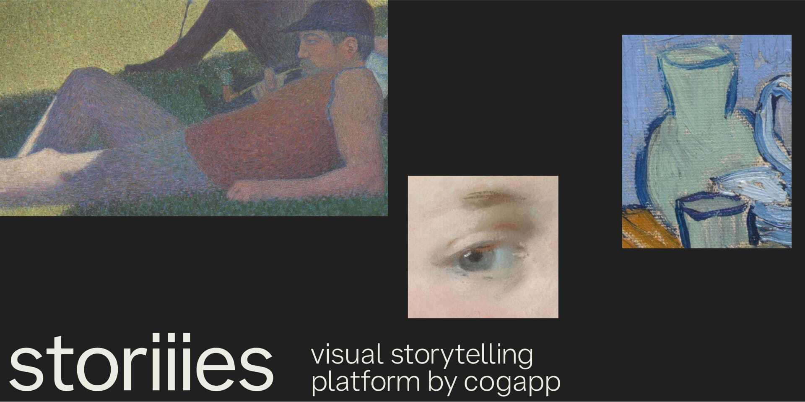

# Storiiies Viewer 



Storiiies Viewer is an open source viewer for [Storiiies](https://www.cogapp.com/r-d/storiiies), the IIIF digital storytelling platform.

## Demo
[See an example StoriiiesViewer in action on codepen](https://codepen.io/Cogapp/pen/JjxbjGz)

## Usage

[API documentation](https://cogapplabs.github.io/StoriiiesViewer/api)

### Adding the dependencies

There are two options for adding StoriiiesViewer to your project:

#### In the browser

(This is the quickest and easiest way to get started)

You can include the JavaScript and CSS in the HTML like so, using the [unpkg CDN](https://unpkg.com/):

```HTML
<head>
  <!-- ... -->
  <link rel="stylesheet" href="https://unpkg.com/browse/@cogapp/storiiies-viewer@latest/dist/storiiies-viewer.css">
  <script src="https://unpkg.com/browse/@cogapp/storiiies-viewer@latest/dist/umd/storiiies-viewer.js"></script>
  <!-- ... -->
</head>
```

Or you could save these files and serve them locally if you prefer.

Including the JavaScript file this way will make `StoriiiesViewer` available globally in JavaScript.


#### Using a bundler

1. Install the dependecy with `npm install @cogapp/storiiies-viewer`
2. Use `import StoriiiesViewer from '@cogapp/storiiies-viewer'` in your code to access the StoriiiesViewer constructor
3. Depending on how your tooling handles importing CSS you might also be able to import the CSS file with `import @cogapp/storiiies-viewer/dist/storiiies-viewer.css` — but you could also use the method above, or copy the contents of the CSS file into your own src files.


### Initialise a viewer
In your HTML:
```HTML
<div id="storiiies-viewer"></div>
```

In your JavaScript
```JS
document.addEventListener('DOMContentLoaded', () => {
  const myViewer = new StoriiiesViewer({
    container: "#storiiies-viewer", // or document.querySelector("#storiiies-viewer")
    manifestUrl: "https://path-to-your-storiiies-manifest",
  });
});
```

## Customisation

To customise of appearance of StoriiiesViewer you have a few options:

1. If you'd prefer to bring all your own styles, StoriiiesViewer can be styled from scratch without needing to include the default stylesheet
2. To 'theme' StoriiiesViewer, you may find the custom properties provided by the default stylesheet to be sufficient
3. Start with default stylesheet and expand or override these styles as you see fit


## Supported manifest formats
StoriiiesViewer supports a subset of the [IIIF presentation API v3](https://iiif.io/api/presentation/3.0/). Specifically, we target `annotationPages` which are included directly in the manifest ([like in this cookbook recipe](https://iiif.io/api/cookbook/recipe/0258-tagging-external-resource/)).

Annotations themselves can either be `text/plain` or `text/html` denoted by the `format` field. For `text/plain` newline characters will be converted and output as `<br>` tags.

StoriiiesViewer has no required fields (aside from those required by the presentation API), but it will render certain values from the manifest if provided. These are:

- [A manifest `label`](https://iiif.io/api/presentation/3.0/#label), which is required by the presentation API and will be shown on a "title slide", before any annotations
- [A manifest level `summary`](https://iiif.io/api/presentation/3.0/#summary), which will appear below the label if provided
- [A manifest level `requiredStatement`](https://iiif.io/api/presentation/3.0/#requiredstatement), which will appear below the summary if provided

> [!NOTE]<br>
> Certain features which aren't currently supported include:
>
> - Externally referenced `annotationPages` ([as shown in this cookbook recipe](https://iiif.io/api/cookbook/recipe/0306-linking-annotations-to-manifests/))
> - Multiple images
> - Non-text based annotations (e.g. audio)
> - Full multi-lingual support
>
> However, pathways exist to enable these features with further development.

> [!WARNING]<br>
> Manifest with a version lower than 3 may load images, but aren't guaranteed to work beyond this, and will display a warning in the console.

### Compatibility with Storiiies Editor

Cogapp maintains a free-to-use editor for Storiiies at [storiiies-editor.cogapp.com](https://storiiies-editor.cogapp.com/). To use a compatible v3 manifest for your story, append the short alphanumeric code from the "view and share" link to a base URL of `https://manifest.storiiies-editor.cogapp.com/v3/`

For example, for the link https://storiiies.cogapp.com/viewer/7e4va/A-Sunday-on-La-Grande-Jatte-1884 use a manifest URL of https://manifest.storiiies-editor.cogapp.com/v3/7e4va

## Local development

### Installation

#### Pre-requisites

- [Node.js / npm](https://docs.npmjs.com/downloading-and-installing-node-js-and-npm)

> [!IMPORTANT]<br>
> Although optional, we recommend using [nvm](https://github.com/nvm-sh/nvm) to match the version of Node used in this project before running the install command, or the npm scripts described below.
>
> If you encounter problems and aren't using the version of Node shown in the [.nvmrc](.nvmrc) file, you should try aligning your node version to this first. This represents a known compatibility with the code here and our dependencies.

#### Setup

Switch node version and install the dependencies in the project root with:

```console
nvm use
npm ci
```

### Compiling and previewing changes

<table width="100%">
  <thead>
    <tr>
      <th width="300px">Command</th>
      <th width="800px">Action</th>
    </tr>
  </thead>
  <tbody>
    <tr>
      <td><code>npm run dev</code></td>
      <td>Watches files in the <a href="./src"><code>src</code></a> directory for changes and serves a preview at <a href="https://localhost:43110">https://localhost:43110</a> with hot module replacement</td>
    </tr>
    <tr>
      <td><code>npm run build</code></td>
      <td>Builds the package for use in production. See "<a href="#usage">Usage</a>" for how this package can be used</td>
    </tr>
  </tbody>
</table>


### Running the tests

<table width="100%">
  <thead>
    <tr>
      <th width="300px">Command</th>
      <th width="800px">Action</th>
    </tr>
  </thead>
  <tbody>
    <tr>
      <td><code>npm run test:gui</code></td>
      <td>Will start the local dev server and run the e2e tests with the interactive GUI</td>
    </tr>
    <tr>
      <td><code>npm run test</code></td>
      <td> Starts the dev server as above, but instead runs the tests without the GUI</td>
    </tr>
  </tbody>
</table>

> [!NOTE]<br>
> `npm run cypress:gui` and `npm run cypress` will also do the same as the above _without_ starting the dev server, if you already have it running.

### Linting the code

<table width="100%">
  <thead>
    <tr>
      <th width="300px">Command</th>
      <th width="800px">Action</th>
    </tr>
  </thead>
  <tbody>
    <tr>
      <td><code>npm run lint</code></td>
      <td>Will lint (and fix where possible) all problems in the code</td>
    </tr>
  </tbody>
</table>

### Image credits from banner image

Georges Seurat. _[A Sunday on La Grande Jatte](https://www.artic.edu/artworks/27992/a-sunday-on-la-grande-jatte-1884)_, 1884-86. The Art Institute of Chicago.<br>
Vincent van Gogh. _[The Bedroom](https://www.artic.edu/artworks/28560/the-bedroom)_, 1889. The Art Institute of Chicago.<br>
Rosalba Carriera. _[A Young Lady with a Parrot](https://www.artic.edu/artworks/103887/a-young-lady-with-a-parrot)_, c. 1730. The Art Institute of Chicago.
